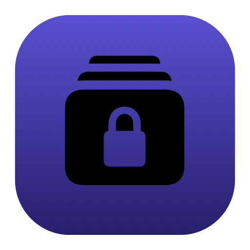
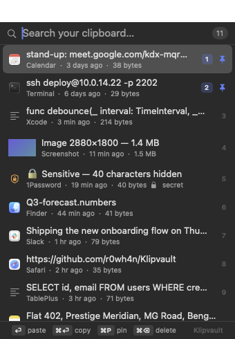
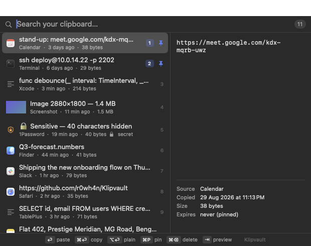

<div align="center">



# Klipvault

### Every copy, sealed.

A clipboard manager for the macOS menu bar that encrypts everything you copy — before it ever touches your disk.

[](https://github.com/r0wh4n/Klipvault/releases)
[](https://github.com/r0wh4n/Klipvault)
[](https://github.com/r0wh4n/Klipvault/releases)
[](https://github.com/r0wh4n/Klipvault/tree/main/Sources)
[](LICENSE)

```bash
brew install --cask r0wh4n/tap/klipvault
```

**Then press ⌘⇧V.** That's the whole setup.

<br>



</div>

<br>

## Your clipboard knows too much

Today you copied an API key, a database password, a customer's email, a one-time code, and something from a private Slack channel. Your clipboard manager wrote all of it to disk in plain text, and your backup software dutifully made three copies.

Klipvault is the same idea, built the other way around. **Encryption isn't a setting — it's the storage layer.** Every item is sealed with AES-256-GCM before it's written, so the history file is inert on its own:

```console
$ xxd ~/Library/Application\ Support/Klipvault/history.vault | head -2
00000000: 434c 5056 3100 0001 a2cf 4379 897f d13f  CLPV1.....Cy...?
00000010: 5f37 e258 7860 7b32 f059 760d ae79 44ba  _7.Xx`{2.Yv..yD.
```

Copy it to another Mac, sync it to Dropbox, pull it out of a Time Machine backup — it gives up nothing.

<br>

## What you get

<table>
<tr><td width="50%" valign="top">

#### 🔐 Encrypted, always
AES-256-GCM on every record and every image. No "enable encryption" checkbox to forget — there is no other mode.

#### 🗓 A 15-day memory
Keep history for 15 days, 90, a year, or forever. Cap it by count too. **Every item shows the exact date it will be deleted.**

#### 📌 Pins that never expire
Pin your stand-up link, your SSH one-liner, your address. Each gets a one-key shortcut — `⌘1`, `⌘2` — from anywhere.

#### 🕵️ It spots your secrets
13 patterns: AWS, GitHub, Slack, Stripe, Google, OpenAI/Anthropic keys, JWTs, PEM blocks, bearer tokens, DB connection strings, cards. Flagged items are masked in the list and can self-destruct in minutes.

</td><td width="50%" valign="top">

#### 🔒 A vault that locks
Add a passphrase and the key stops existing on your Mac. Auto-lock on idle, on sleep, on screen lock. Bind a **panic wipe** that erases everything, instantly.

#### 🖼 Text, images and files
Rich text preserved or stripped on demand. Screenshots stored as separate encrypted blobs, so a 4K image never slows the list down. Files re-paste as real files.

#### ⌨️ Built for the keyboard
Six rebindable global hotkeys. Fuzzy, contains, exact or regex search. `⏎` paste · `⌥⏎` plain · `⌘P` pin · `⌘⌫` delete.

#### 🕸 No network. At all.
No account, no sync, no telemetry, no update check, no dependencies. There isn't a single `URLSession` in the codebase.

</td></tr>
</table>

<div align="center">

<br><em>Press <code>⇥</code> for the preview pane — source app, size, use count, and when it expires.</em>
</div>

<br>

## Klipvault vs Maccy

[Maccy](https://github.com/p0deje/Maccy) is excellent, and it's the reason this exists — it set the bar for what a lightweight Mac clipboard manager should feel like. Klipvault keeps that shape and rebuilds the parts that matter when your clipboard holds credentials.

| | Klipvault | Maccy |
|:--|:--|:--|
| **Encrypted at rest** | ✅ AES-256-GCM, always on | ❌ Plain Core Data store |
| **Passphrase protection** | ✅ 310,000 PBKDF2 rounds, key stored nowhere | ❌ |
| **Lock the vault** | ✅ Idle, sleep, screen lock, or a hotkey | ❌ |
| **Secret detection** | ✅ 13 patterns, masked + optional minute-level TTL | ❌ |
| **Panic wipe** | ✅ One key erases the vault and the clipboard | ❌ |
| **Retention** | ✅ By age *and* count, pins exempt | ⚠️ By count only |
| **Expiry shown per item** | ✅ | ❌ |
| **Large images** | ✅ Separate encrypted blobs, thumbnail in the index | ⚠️ Stored inline |
| **Search** | ✅ Fuzzy · contains · exact · regex | ✅ Fuzzy · exact |
| **Pins** | ✅ With one-key shortcuts | ✅ |
| **Ignore rules** | ✅ App, regex, length, password-manager markers | ✅ App, regex |
| **Preference tabs** | ✅ 7 (incl. a Security tab) | ✅ 6 |
| **Dependencies** | ✅ **Zero** | ⚠️ Sparkle, KeyboardShortcuts, Settings |
| **Network code** | ✅ **None** | ⚠️ Update checks |
| **Diagnostics** | ✅ `--probe` explains every capture decision | ❌ |

**Where Maccy still wins, honestly:** it's **notarized by Apple**, it's in **Homebrew core** and the **App Store**, it **auto-updates**, it's **localized into a dozen languages**, and it has years of real-world hammering behind it. Klipvault is version 1.0 from a single developer, ad-hoc signed, in a personal tap.

If you want the safest, most battle-tested choice, install Maccy. If your clipboard holds things you'd rather not leave in plain text on a disk, keep reading.

<br>

## Security, stated plainly

Security claims are worth what their threat model is worth, so here's Klipvault's — no marketing.

```
~/Library/Application Support/Klipvault/     0700
├── history.vault      0600   encrypted append-only log
├── key.local          0600   the 256-bit key  ·  default mode only
├── key.wrapped               key sealed under your passphrase  ·  passphrase mode only
└── blobs/             0700
    └── <uuid>.bin     0600   one encrypted image each
```

**Default mode** — a random 256-bit key is generated on first run and written to `key.local`. Everything is sealed with AES-256-GCM before it hits the disk.

> **Protects against:** the history file being copied, cloud-synced, pulled from a backup, recovered off a drive you sold, or read by another account.
> **Does not protect against:** something already running as you. It can read `key.local` too. That's the honest cost of zero friction.

**Passphrase mode** — flip it on in Security. The key is re-derived from your passphrase with 310,000 rounds of PBKDF2-HMAC-SHA256 and `key.local` is deleted.

> Now full-disk access isn't enough, and neither is your unlocked laptop while the vault is locked. There is **no recovery and no backdoor** — lose the passphrase and the history is gone. That's the feature. *Write it down somewhere physical first.*

**Verify it yourself.** The shipped binary carries its own test suite — not mocks; it builds a real vault, encrypts real records, and greps the raw bytes on disk:

```console
$ /Applications/Klipvault.app/Contents/MacOS/Klipvault --selftest
  ok   wrong passphrase is rejected
  ok   no plaintext on disk
  ok   blob is encrypted at rest
  ok   locked vault reads nothing
  ok   retention dropped exactly the unpinned old item (dropped 1)
  … 24 checks …
selftest: all checks passed
```

If encryption ever silently broke, the build would fail. And `grep -r URLSession Sources/` returns nothing — check it yourself, that's the point of shipping 2,700 readable lines.

<br>

## Shortcuts

**Global** · `⌘⇧V` opens Klipvault. Paste-last, paste-as-plain, clear, lock and panic wipe are all bindable in Preferences.

**In the popup**

| | | | |
|:--|:--|:--|:--|
| type | filter | `⌘1`–`⌘9` | paste that row |
| `↑` `↓` / `⌃P` `⌃N` | move | `⌘`+letter | paste that pin |
| `⏎` | paste | `⌘P` | pin / unpin |
| `⌘⏎` | copy, don't paste | `⌘⌫` | delete |
| `⌥⏎` | paste as plain text | `⇥` | preview pane |
| `⎋` | clear search, then close | `⌘,` | preferences |

<br>

## Install

```bash
brew install --cask r0wh4n/tap/klipvault
```

<details>
<summary><b>Or build it from source</b> — one command, no Xcode project</summary>

<br>

```bash
git clone https://github.com/r0wh4n/Klipvault.git
cd Klipvault
./install.sh
```

`install.sh` checks your macOS version, offers to fetch the Command Line Tools if they're missing, builds a universal binary, replaces any running copy, installs to `/Applications`, clears the quarantine flag and launches it. About ten seconds.

Just want the `.app` without installing? Run `./build.sh`.

</details>

<details>
<summary><b>Uninstalling</b></summary>

<br>

```bash
brew uninstall --cask klipvault          # keeps your encrypted history
brew uninstall --zap --cask klipvault    # deletes it too
```

From a source install: `./install.sh --uninstall` — it asks separately before touching your vault.

</details>

Requires **macOS 14 or later**. Universal binary — Apple Silicon and Intel.

On first launch Klipvault offers to open **Privacy & Security → Accessibility**. Grant it and Klipvault presses `⌘V` for you; decline and everything still works, you just paste yourself. To start it at login, tick one box in **General**.

<br>

## FAQ

<details><summary><b>Does it sync between Macs?</b></summary><br>No, and it won't — sync means a server or a shared folder, and both undermine the point. Copy the vault folder yourself; with a passphrase set, it's safe to put in Dropbox.</details>

<details><summary><b>What if I forget my passphrase?</b></summary><br>The history is unrecoverable. No key escrow, no reset link. If that's too much risk, don't enable passphrase mode — the default already protects the file itself.</details>

<details><summary><b>Will it slow down my Mac?</b></summary><br>It checks the pasteboard's change counter every 0.35s (adjustable) and does nothing at all unless it moved. Encrypting a copied paragraph takes microseconds.</details>

<details><summary><b>Why not notarized?</b></summary><br>Notarization needs a paid Apple Developer account. The Homebrew cask clears the quarantine flag so you never see a Gatekeeper prompt; a manual download needs <code>xattr -dr com.apple.quarantine Klipvault.app</code>.</details>

<details><summary><b>Can I get my data out?</b></summary><br>Two ways, in Storage: an encrypted backup, or a plain JSON export that warns you it's plain before writing it.</details>

<details><summary><b>Why an append-only log instead of a database?</b></summary><br>A database means a dependency, and it stores your clipboard in a format designed to be readable. The log is fewer moving parts and encrypted by default. Copying is a pure append — the cheapest possible hot path.</details>

<br>

## Built from

Eight Swift files, ~2,800 lines, Apple frameworks only.

| | |
|:--|:--|
| `Vault.swift` | Encryption, keys, the append-only log, blob store, retention |
| `Watcher.swift` | Pasteboard polling, capture rules, writing back, sending `⌘V` |
| `Store.swift` | Observable state, search and ranking, item actions |
| `Panel.swift` | The popup, keyboard handling, list, preview pane |
| `Prefs.swift` | Seven preference tabs, hotkey recorder, backup, passphrase generation |
| `Settings.swift` | Every preference key and default, and the secret scanner |
| `Hotkey.swift` | Carbon global hotkeys — no Accessibility permission needed |
| `main.swift` | Menu bar, unlock window, app delegate, self-test, icon and screenshot generation |

<br>

<div align="center">

**MIT licensed.** Take it, fork it, ship it.

Klipvault owes its shape to [Maccy](https://github.com/p0deje/Maccy) by Alex Rodionov — an excellent app that has served a lot of people well for a long time.

</div>
